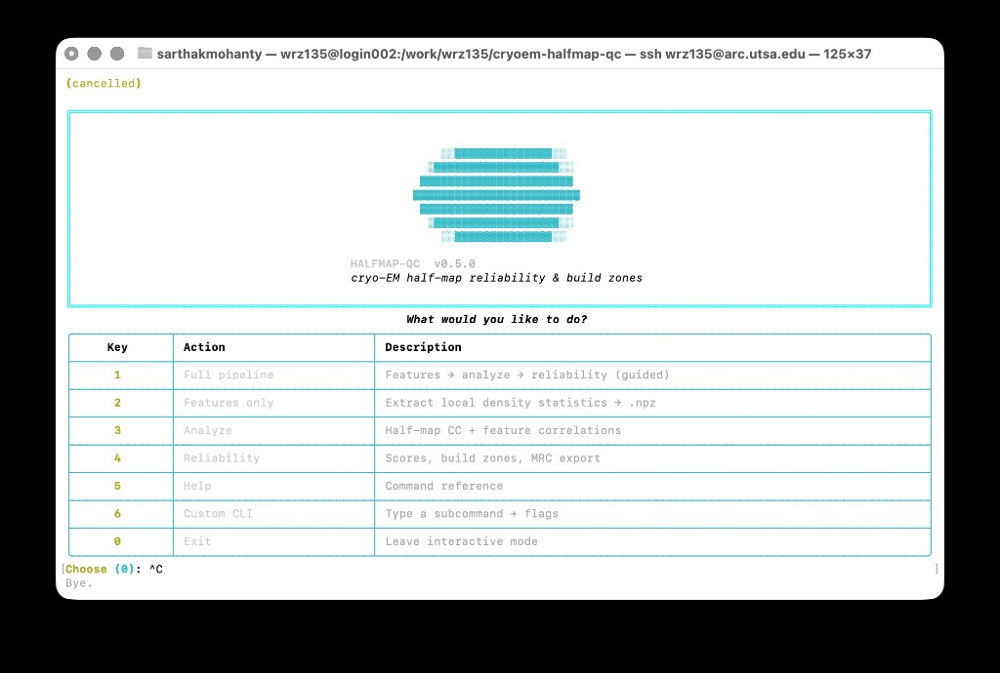

# cryoem-halfmap-qc

[](https://pypi.org/project/cryoem-halfmap-qc/)
[](https://doi.org/10.5281/zenodo.20618526)
[](LICENSE)

Local **reliability scores** and **build zones** for cryo-EM maps from half-maps and density features. Python **3.10+**.

```bash
pip install cryoem-halfmap-qc
halfmap-qc          # interactive: two half-map paths → two MRC outputs
halfmap-qc help     # CLI reference
```

Interactive mode asks for **half-map 1** and **half-map 2**, then writes `{stem}_reliability.mrc` and `{stem}_build_zones.mrc` under `halfmap_qc_out/` next to half-map 1 (contour is chosen automatically from the averaged map).



## Pipeline (non-interactive / advanced)

Three commands, in order. Pass your own map paths and output directories.

```bash
# 1. Features from a map (.mrc / .map)
halfmap-qc features map.mrc --out features.npz --float32

# 2. Half-map metrics + correlations
halfmap-qc analyze \
  --features features.npz \
  --half1 half1.map --half2 half2.map \
  --reference ref.map \
  --contour CONTOUR \
  --out-dir analysis_out

# 3. Reliability score + build-zone MRCs
halfmap-qc reliability \
  --reference ref.map --half1 half1.map --half2 half2.map \
  --features features.npz \
  --contour CONTOUR \
  --out-dir reliability_out
```

`--contour` is the density threshold for the analysis mask (same value in steps 2 and 3). Step 2 (analyze) is optional if you only need the reliability and build-zone MRCs.

**Reliability outputs:** `{label}_reliability.mrc` and `{label}_build_zones.mrc` on your reference grid.

Flag details: `halfmap-qc features --help`, `halfmap-qc analyze --help`, `halfmap-qc reliability --help`.

## HPC (ARC)

Default login `python3` is too old (3.6). Conda modules load on **compute nodes only**:

```bash
srun -p compute1 -n 1 -t 02:00:00 --pty bash
module load miniconda/24.4.0
conda activate halfmap-qc    # after one-time: conda create -n halfmap-qc python=3.12 -y && pip install cryoem-halfmap-qc
```

**Batch job** — copy `scripts/halfmap_qc_cluster.sbatch.example`, set `MAP`, `HALF1`, `HALF2`, `REF`, `CONTOUR`, and submit. Each step aborts if the previous one fails.

```bash
cp scripts/halfmap_qc_cluster.sbatch.example run_my_map.sbatch
# edit paths in run_my_map.sbatch
sbatch run_my_map.sbatch
```

If install fails with empty `(from versions:)`, check `python --version` (need ≥3.10) and `pip install -U pip`.

## Citation

```bibtex
@software{mohanty2026cryoem_halfmap_qc,
  author = {Mohanty, Sarthak},
  title = {cryoem-halfmap-qc: local map reliability from cryo-EM density and half-maps},
  year = {2026},
  doi = {10.5281/zenodo.20618526},
  url = {https://doi.org/10.5281/zenodo.20618526},
  version = {0.5.3}
}
```

MIT — see [LICENSE](LICENSE).
